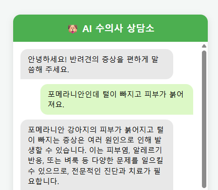
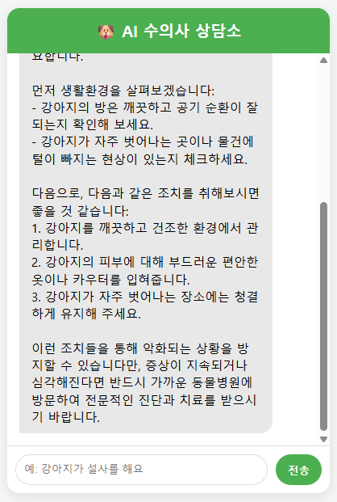

# 오프라인 AI 수의사 보조 엔진 — 포켓 수의사 (PocketVet)

## 프로젝트 개요

인터넷이 차단된 환경에서도 100% 로컬(On-Device)로 동작하는 C++ 기반 반려동물 의료 지식 검색 엔진입니다. 클라우드 API에 의존하지 않고 C++ 로우레벨에서 RAG(검색 증강 생성) 파이프라인을 직접 구현해, 데이터가 외부로 나가지 않는 보안성과 빠른 응답성을 동시에 확보하는 것이 목표였습니다.

처음에는 터미널 프로그램으로 시작했지만, 점차 C++ 경량 웹 서버를 내장한 RESTful API 백엔드와 웹 채팅 UI까지 붙여, 혼자서 로컬 풀스택 서비스 형태로 완성했습니다.



## 기술 스택

- **Core Language:** C++17
- **Frontend:** HTML5, CSS3, Vanilla JavaScript (Fetch API, Server-Sent Events)
- **Backend & Network:** cpp-httplib (REST API 서버), Windows Socket (ws2_32)
- **AI Inference:** llama.cpp (GGUF 양자화, Vulkan GPU 가속)
- **Models:** Qwen2.5-3B-Instruct (LLM), BGE-M3 (Embedding)
- **Concurrency:** std::async, std::future, std::mutex
- **Data Engineering:** RapidCSV, 커스텀 벡터 캐싱 (19,000+ items)
- **Memory:** std::deque (슬라이딩 윈도우 컨텍스트)
- **Build:** CMake, MinGW-w64 (UCRT64)

## 구현 과정

### 로컬 추론 인프라



19,000건의 수의학 Q&A 말뭉치를 C++에서 빠르게 로드할 수 있는 CSV로 전처리하고, `llama.cpp`를 로컬에서 직접 빌드해 외부 서버 없이 3B급 LLM을 구동하는 환경을 만들었습니다.

### 의미 기반 검색과 벡터 캐싱

`BGE-M3` 모델로 질문을 1,024차원 벡터로 변환하고, 코사인 유사도로 관련 지식을 검색합니다. 문제는 19,000건의 임베딩 연산에 매번 3시간가량 걸린다는 점이었는데, 최초 1회만 계산한 뒤 결과를 파일(`vector_db.csv`)로 저장하는 캐싱 로직을 만들어 재실행 시 로딩을 1초 미만으로 줄였습니다.

### 멀티턴 대화와 샘플링

`std::deque` 기반 슬라이딩 윈도우로 최근 대화 2~3개만 유지하고 오래된 기록은 버려, 토큰 효율과 문맥 유지를 함께 잡았습니다. 또 `Repetition Penalty`, `Top-P`, `Temperature` 샘플러를 직접 구성해 같은 문장을 반복하는 현상을 해결했습니다.

### 비동기 처리

`std::async`로 AI 연산을 백그라운드 스레드에 분리해, 추론 중에도 메인 스레드가 멈추지 않도록 했습니다.

### C++ 웹 서버와 프론트엔드 연동

`cpp-httplib`로 C++ 엔진 자체를 HTTP 웹 서버(포트 8080)로 띄우고, JSON을 반환하는 API(`GET /ask`)를 만들었습니다. 여기에 브라우저용 채팅 UI(`index.html`)를 붙이고 Fetch API와 CORS 설정으로 연동했으며, 여러 요청이 동시에 들어와도 AI 메모리가 충돌하지 않도록 `std::mutex`로 Thread-safe하게 처리했습니다.

### GPU 가속과 실시간 스트리밍

MSYS2 환경에 Vulkan 라이브러리를 통합하고 CMake 옵션(`-DGGML_VULKAN=ON`)을 적용해, CPU 전용 추론보다 텍스트 생성 속도를 크게 끌어올렸습니다. 마지막으로 SSE(Server-Sent Events)를 도입해, 모든 연산이 끝날 때까지 5~10초를 기다리던 기존 방식 대신 생성되는 토큰을 청크 단위로 즉시 브라우저에 전달하는 실시간 타이핑 UX를 구현했습니다.

## 핵심 트러블슈팅

### 1. Windows 한글 입력 깨짐

UTF-8 설정을 했는데도 사용자 입력이 깨져 AI가 엉뚱한 답을 내놓았습니다. `SetConsoleCP(CP_UTF8)`로 키보드 입력 인코딩을 맞추고, Windows 엔터키에 딸려오는 `\r` 문자를 제거해 입력 데이터를 정리했습니다.

### 2. 샘플러 체인 누락으로 인한 런타임 Assert 에러

`GGML_ASSERT(cur_p.selected >= 0)` 에러로 프로그램이 강제 종료됐습니다. 확률 필터링만 설정하고 정작 실제 단어를 고르는 단어 선택기(Distribution Sampler)가 빠져 있던 게 원인이었습니다. `llama_sampler_init_dist`를 샘플러 체인에 명시적으로 추가해 해결했습니다.

### 3. 소켓 링커 에러와 헤더 충돌

웹 서버 기능을 빌드할 때 `undefined reference to '__imp_WSAStartup'` 링커 에러와 `winsock2.h` 관련 경고가 났습니다. `CMakeLists.txt`에 `target_link_libraries(pet_engine PRIVATE ws2_32)`를 추가해 OS 소켓 모듈을 명시적으로 연결하고, 코드 상단에 `#define WIN32_LEAN_AND_MEAN`을 선언해 구버전 Windows 헤더가 불필요하게 끼어드는 문제를 막았습니다.

### 4. CSV 구조를 깨뜨리는 개행 문자와 JSON 이스케이프

원본 데이터에 섞인 `\n`과 `"` 문자가 CSV 열 구조를 깨거나 웹 서버의 JSON 응답 포맷을 망가뜨렸습니다. 로딩 시점에 텍스트를 정리하는 함수를 만들어 데이터 무결성을 확보하고, API 응답을 보내기 전 C++ 내부에서 이스케이프 문자(`\"`, `\\n`)를 치환해 안전한 JSON을 구성했습니다.

### 5. 스트리밍 중 한글 바이트 쪼개짐 (UTF-8 Chunking)

SSE 스트리밍에서 3바이트로 된 한글이 1바이트씩 쪼개져 전송되면서, 브라우저에 깨진 문자로 표시되거나 글자가 중복 출력됐습니다. 프론트엔드에서 조각을 이어 붙이는(`+=`) 방식이 멀티바이트 문자를 처리하지 못한 것이 원인이었습니다. 그래서 C++ 백엔드가 매번 '누적된 전체 텍스트'를 보내고 프론트엔드는 그것으로 화면을 덮어쓰는(`=`) 방식으로 바꿔, 멀티바이트 언어의 스트리밍 문제를 해결했습니다.


## 빌드 및 실행

CMake 기반으로 빌드합니다.

```bash
# 빌드 (Vulkan GPU 가속 옵션 활성화)
mkdir build
cd build
cmake .. -G "MinGW Makefiles" -DGGML_VULKAN=ON
cmake --build .

# C++ 백엔드 웹 서버 실행
cd ..
./build/pet_engine.exe
# 터미널에 "웹 서버가 포트 8080에서 접속을 기다리고 있습니다" 출력 확인
```

서버가 켜진 상태에서 프로젝트 폴더의 `index.html`을 브라우저로 열면 채팅 UI로 바로 사용할 수 있습니다. 또는 주소창에 `http://localhost:8080/ask?q=질문내용`으로 API를 직접 호출할 수도 있습니다.

---

이 프로젝트는 C++ 로우레벨 시스템 제어부터 네트워크 서버 구축, 프론트엔드 연동, 로컬 LLM 추론까지 하나의 서비스로 엮어, 클라우드 없이 동작하는 온디바이스 AI를 직접 구현해 본 경험입니다.
